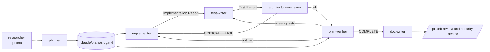

# Agents

Project subagents for dev-digest. Each file in this folder is one agent; the file itself is the
source of truth for its rules. This README is a guide to the set.

## Overview

| Agent | Role | Model | Tools | Writes files |
|---|---|---|---|---|
| [`researcher`](researcher.md) | Finds facts in the repo or on the web | `sonnet` | `Read, Grep, Glob, WebSearch, WebFetch` | No |
| [`planner`](planner.md) | Turns a task into a Development Plan | `opus` | `Read, Grep, Glob` | No |
| [`implementer`](implementer.md) | Executes a plan on server and client, keeps existing tests green | `sonnet` | `Read, Grep, Glob, Edit, Write, Bash` | Yes (production code) |
| [`test-writer`](test-writer.md) | Writes and runs the plan's tests for client and server | `sonnet` | `Read, Grep, Glob, Edit, Write, Bash` | Yes (test files only, hook-enforced) |
| [`architecture-reviewer`](architecture-reviewer.md) | Checks architectural boundaries, reports findings with evidence | `opus` | `Read, Grep, Glob` | No |
| [`plan-verifier`](plan-verifier.md) | Verifies the code against every plan item with evidence | `opus` | `Read, Grep, Glob, Bash` | No (Bash allowlist hook) |
| [`doc-writer`](doc-writer.md) | Documents implemented features with diagrams, places them in `docs/` and `specs/` | `sonnet` | `Read, Grep, Glob, Edit, Write` | Yes (`docs/` and `specs/` only, hook-enforced) |

None of the agents has the `Agent` tool, so they cannot spawn further subagents. The orchestrator (main session or you) drives every hand-off.

## Typical flow

1. Optionally ask `researcher` for facts the plan depends on.
2. `planner` returns a plan as a message. It has no write tool.
3. The orchestrator saves it to `.claude/plans/<task-slug>.md`. That folder is git-ignored.
4. `implementer` executes the plan's code steps and returns an Implementation Report.
5. `test-writer` writes the plan's test items and returns a Test Report.
6. `architecture-reviewer` gets the changed-file list (plus the `git diff` and depcruise output, which it cannot run itself) and returns findings.
7. `plan-verifier` checks every plan item and returns a Plan Verification Report. Not-met items go back to `implementer` or `test-writer`.
8. `doc-writer` documents the verified feature under `docs/` or `<pkg>/docs/`, and acceptance criteria under `specs/`.
9. Security review and `/pr-self-review` are done separately; they are not part of these agents.
10. After the work is verified and reviewed, delete the plan file. Durable findings go to `<pkg>/INSIGHTS.md` through `/engineering-insights`.

## Token-efficient hand-offs

Observed on the Intent Layer run: about 750k subagent tokens, most of it re-reading the same files and long reports.
These rules cut that without dropping any validation step. Savings are estimates, not measurements.

- **Pass paths, not text.** Hand the plan over as `.claude/plans/<slug>.md`. Agents read only the sections they need.
- **Give reviewers the diff.** Before `architecture-reviewer` and `plan-verifier`, write `git diff` and `git diff --cached` plus the changed-file list to the scratchpad and pass the path with the `check.sh` output. Without it the reviewer spends calls finding what changed and cannot tell new lines from old ones.
- **Short reports in chat, full tables in a file.** Ask reviewers to return only findings, partial / not-met / unverifiable items and the commands run, each with `path:line`. A line such as "met: N items" replaces the passing rows. The full matrix goes to a file in the scratchpad.
- **Do not re-run what already passed.** `plan-verifier` trusts the implementer's pasted command output for typecheck and test results and re-runs only a sample plus the onion gate, which is the one check the implementer's word is not enough for.
- **Read shared context once.** `researcher` and `planner` both read INSIGHTS, `prompt.ts`, `run-executor.ts` and the contracts. Use `researcher` for external or web questions only; the planner reads the repo itself.
- **Pick the model by the step.** Keep `opus` for planning and the two reviewers, and `sonnet` for the implementer and writers. For mechanical edits (dead-code removal, moving a constant, INSIGHTS appends) pass `model: "haiku"` on the Agent call, or make the edit in the main session.
- **Skip the agent for small fixes.** A review round that finds one-line issues is cheaper to fix in the main session than through a new `implementer` run. Re-run a reviewer only on the files the fix touched.
- **Keep validation.** Per-item plan evidence, the independent onion gate and the separate architecture review each caught a real defect (label/id mismatch, raw error text in the Live Log, a new `container` access), so they stay.

## researcher

- **Responsibility:** read-only research. Repository questions (cited as `path:line`) or external questions (docs, web). Asks clarifying questions first when the task is vague.
- **Permissions:** no Write, Edit or Bash. Does not use skills or slash commands.
- **Input:** a concrete question, scope (package or sources) and desired depth.
- **Output:** a structured report: Question, Conclusions (with confidence), Evidence, References or Sources, Not found / unverified, Open questions. Two templates, one for repository and one for external research.

## planner

- **Responsibility:** produce a Development Plan that respects the project modules, available skills, `INSIGHTS.md` entries and architecture constraints. Assigns skills to each step so the plan cannot conflict with implementation rules. Reading the routed skills is mandatory before it writes the plan (always `onion-architecture` for server work and `frontend-ui-architecture` for client work), and each plan step cites the skill rules that shaped it. Does not plan review work.
- **Permissions:** read-only. No Bash, Write, Edit, web or `Agent`.
- **Input:** a task description. It reads, in order, root and package `AGENTS.md`, `<pkg>/INSIGHTS.md`, `<pkg>/docs/` and `<pkg>/specs/`, the "Agent routing" section of [`../skills/README.md`](../skills/README.md) with the routed `SKILL.md` files, then the code.
- **Output:** a Development Plan returned as text: Goal and scope, Applicable constraints, Skill assignments, Steps (files, change, skills, done-when), Test plan, Risks and open questions, Not verified.
- **Stops and asks** (intake gate) when the goal or scope is unclear.

## implementer

- **Responsibility:** execute the plan on backend and frontend, select the project skills, run the existing tests and typechecks for the touched packages, and verify only its own changes. Priorities, in order: write the code, make the tests work, and self-review its own diff after each step while writing. Architecture and security review, full-repo e2e and `/pr-self-review` are out of its scope.
- **Permissions:**
  - Edits files and runs Bash, no web and no `Agent`.
  - Does not commit, push or open PRs.
  - Does not touch `server/clones/**`, `*/src/vendor/**` (except the paired `shared` change a plan names), applied migrations or lockfiles.
  - A frontmatter hook enforces the Bash rules (see below).
- **Skills (loaded on demand, not preloaded):** reads only the `SKILL.md` files the plan assigns per step (routing in `../skills/README.md`, "Agent routing"), plus `<pkg>/INSIGHTS.md` for each package it edits. Applying them is checked through the report: one concrete rule per skill and the file where it was applied. Not for this agent: `pr-self-review`, `mermaid-diagram`. Planned, not built yet: a hook gate that denies edits until the matching skill was read.
- **Input:** an approved plan from `.claude/plans/` (read only). Without a plan it stops and asks.
- **Output:** an Implementation Report returned as text: Steps with status and `path:line`, Skills applied per step, Deviations from the plan, Verification (command, result, output excerpt), Not run / unverified, Hand-off to reviewers (changed files, contracts and migrations touched, suggested INSIGHTS entries).

## test-writer

- **Responsibility:** write and run the plan's test items (section 5), choosing the lane per behaviour (client RTL, server hermetic, `*.it.test.ts`). Applies `react-testing-library` and the `onion-architecture` testing reference; records repo overrides (no MSW, so `vi.mock` of hooks). Never edits production code; a needed source change is reported as a blocker.
- **Permissions:** edits files and runs Bash. The implementer Bash guard and [`test-writer-path-guard.sh`](../hooks/test-writer-path-guard.sh) apply; the path guard allows only `server/test/**`, `client/src/test/**`, `*.test.ts(x)` under `client/src`, `reviewer-core` tests and `e2e/specs/*.flow.json`.
- **Input:** a plan path or an explicit list of behaviours. **Output:** Test Report (coverage map with "what would make it fail", skills applied, deviations, verification, not covered, hand-off).

## architecture-reviewer

- **Responsibility:** verify onion layering, client placement, vendored `shared` drift, `reviewer-core` purity and migrations on changed lines only. Every finding carries `path:line`, the rule and quoted evidence.
- **Permissions:** read-only (`Read, Grep, Glob`). It cannot run `git` or depcruise, so the orchestrator pastes the changed-file list, the diff and the `onion-architecture/scripts/check.sh` output; without the gate output it reports "gate not run".
- **Output:** Architecture Review Report (verdict, findings table with confidence, gate results, checked-and-clean per area, not verified, hand-off). Security review and plan conformance are out of scope.

## plan-verifier

- **Responsibility:** explode the plan into numbered items and give each a status (met, partial, not met, unverifiable) with `path:line` or command evidence. It never substitutes verification with general advice, and "the implementer said so" is not evidence.
- **Permissions:** Read, Grep, Glob and Bash behind [`readonly-bash-guard.sh`](../hooks/readonly-bash-guard.sh): single commands only (no chaining or redirects), limited to `vitest run`, `tsc --noEmit`, `npm test` / `npm run typecheck`, read-only `git`, the onion `check.sh`, `ls`, `cat`, `wc`, `jq`.
- **Output:** Plan Verification Report (verdict, item table, unplanned changes, commands run, not verified, hand-off).

## doc-writer

- **Responsibility:** document what is implemented (verified in code), convert plans and reports into docs with Mermaid diagrams, and place them: `docs/` for cross-cutting, `<pkg>/docs/` for package deep-dives, `specs/` for acceptance criteria. Prefers extending an existing doc and indexing new files in the folder's README.
- **Permissions:** Read, Grep, Glob, Edit, Write; [`doc-writer-path-guard.sh`](../hooks/doc-writer-path-guard.sh) allows only `docs/` and `specs/` folders. It never edits `AGENTS.md`, `CLAUDE.md`, `INSIGHTS.md`, `README.md` or code.
- **Output:** Documentation Report (files, placement rationale, diagrams, source facts, gaps, hand-off).

### Bash guard

[`../hooks/implementer-bash-guard.sh`](../hooks/implementer-bash-guard.sh) runs before every Bash call of the implementer and the test-writer only. It does not affect the main session.

| Decision | Commands |
|---|---|
| deny | `git commit`, `git push`, `docker compose down -v`, `rm -rf`, `pnpm` / `corepack` |
| ask | `npm install` and similar in `server/` or `client/`, or at the repo root or an unknown directory |
| allow | `npm ci` / `npm install` in `reviewer-core/` or `e2e/` |
| no decision | everything else (normal permission flow) |

It matches command text, so a script that runs a denied command internally is not caught.

## Orchestration rules

Advisory (the orchestrating session follows them; no hook can enforce them):

- **Dependent stages run one after another.** `planner` → `implementer` → `test-writer` → reviewers → `doc-writer` each need the previous output. Starting them together only makes them wait on each other.
- **One writer at a time per working tree.** `implementer`, `test-writer` and `doc-writer` never run concurrently on the same checkout. Concurrent writers need `isolation: "worktree"`.
- **Parallel only for independent read-only work.** `architecture-reviewer` and `plan-verifier` look at the same finished change without touching it, so they may run together. Several `researcher`s on disjoint questions likewise.
- **No agent team for a single file or a linear plan.** Do it in the main session or with one agent.
- **Enforced, not advisory:** write access is limited by `tools:` plus the path and Bash guard hooks above, never by a sentence in a prompt.

## Sources behind the rules

Fetched 2026-10-04. The 1,536-character, 500-line and 15,000-token limits came through a summarizing fetch tool and were not spot-checked.

| Source | Rule | Where it applies |
|---|---|---|
| [Sub-agents docs](https://code.claude.com/docs/en/sub-agents) | An agent is one markdown file; `name` and `description` required; `description` drives delegation | Frontmatter of all agents |
| Sub-agents docs | `tools` is an allowlist; omit `Agent` to prevent spawning | Tool lists of both agents |
| Sub-agents docs | `skills:` preloads full skill content at startup; not used here, to save context (about 30k tokens for all 12) | Skills are read on demand instead |
| Sub-agents docs | Hooks can be defined in agent frontmatter (`PreToolUse`, matcher `Bash`) | `implementer` guard hook |
| [Hooks reference](https://code.claude.com/docs/en/hooks) | `permissionDecision` is `allow`, `deny`, `ask` or `defer`, returned as JSON on exit 0 | `implementer-bash-guard.sh` |
| [Best practices](https://code.claude.com/docs/en/best-practices) | Separate research and planning from implementation | `planner` / `implementer` split |
| Best practices | A spec names files and interfaces, states out-of-scope, and ends with a verification step | Plan sections 1, 4, 5 |
| Best practices | Give the agent a runnable check and require evidence, not assertions | Implementer verification step and report section 4 |
| Best practices | The agent doing the work should not grade it; review in a fresh context | Implementer scope limit, hand-off section |
| Best practices | Hooks are deterministic, prompt rules are advisory | Bash guard |
| [Multi-agent research system](https://www.anthropic.com/engineering/built-multi-agent-research-system) (2025-06-13) | Each subagent needs an objective, output format, tool guidance and clear boundaries | Hard rules and output templates |
| [Context engineering](https://www.anthropic.com/engineering/effective-context-engineering-for-ai-agents) (2025-09-29) | Return condensed summaries; keep tool sets small; load context just in time | Fixed templates, minimal tools, lazy reading of INSIGHTS and docs |
| [Building effective agents](https://www.anthropic.com/engineering/building-effective-agents) (2024-12-19) | Orchestrator-workers fits multi-file changes; add structure only when simpler options fall short | Two-agent design |
| [Skills docs](https://code.claude.com/docs/en/skills) | Keep `SKILL.md` small and use progressive disclosure | Agents reference skills instead of copying them |
| Repo: `AGENTS.md`, `<pkg>/AGENTS.md`, `<pkg>/INSIGHTS.md` | Do-not-touch list, vendored `shared` copies, migrations via drizzle-kit, test naming, `pnpm` workaround | Planner constraints, implementer hard rules and verification table |
| Repo: [`researcher.md`](researcher.md) | Structure: hard rules, intake gate, fixed template, `path:line` citations | Style of `planner` and `implementer` |

Added with the four review and test agents (fetched 2026-10-04):

| Source | Rule | Where it applies |
|---|---|---|
| Sub-agents docs | A read-only reviewer uses `tools: Read, Grep, Glob`; `tools` is a hard restriction, a prompt line is advisory | `architecture-reviewer`, path and Bash hooks |
| Sub-agents docs | A Bash-capable agent is restricted with a scoped `PreToolUse` hook | `plan-verifier`, `test-writer`, `doc-writer` guards |
| [Testing Library queries](https://testing-library.com/docs/queries/about/#priority) | Role-first query priority; test ids last | `test-writer` |
| [Testing implementation details](https://kentcdodds.com/blog/testing-implementation-details) | Test behaviour, not implementation | `test-writer` |
| [dependency-cruiser](https://github.com/sverweij/dependency-cruiser) | Layer rules as forbidden `from` / `to` import edges | `architecture-reviewer` evidence format |
| [Diátaxis](https://diataxis.fr/), [GitHub Mermaid](https://docs.github.com/en/get-started/writing-on-github/working-with-advanced-formatting/creating-diagrams) | Separate doc types by reader need; Mermaid renders in Markdown | `doc-writer` |

**Not from an official source (my design):** the seven plan sections and the report sections of every agent, the choice of models (`opus` for the two reviewers, `sonnet` for the writers), the per-item met / partial / not met / unverifiable verdicts (inferred from "building effective agents"), and not setting `permissionMode`.

## Maintenance

- Skill routing lives only in the "Agent routing" section of [`../skills/README.md`](../skills/README.md). Update it there, not in the agents.
- A new skill reaches the implementer through the routing table in `../skills/README.md` and the planner's assignments; nothing in `implementer.md` needs to change. Skills are read per step, so their cost scales with the task.
- Plans in `.claude/plans/` are temporary and git-ignored.
